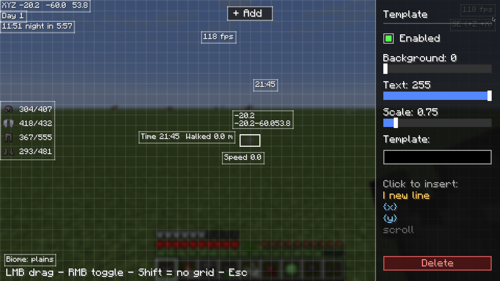

# HudForge

**Build your own HUD in Minecraft — no config files, no code.**

HudForge is a client-side Fabric mod that lets you create custom HUD widgets from templates, drag them anywhere on screen, and style them live in an in-game editor. Show coordinates, FPS, armor durability, biome, real-world time, and much more — however you want it.

## Features

- **In-game editor** — press a key, drag widgets anywhere, no editing files by hand.
- **Template widgets** — build any widget from a text template with live data placeholders, e.g. `XYZ {x} {y} {z}` or `{helmet_icon} {helmet}`.
- **Item icons** — show armor and held-item icons right next to their durability.
- **Multi-line widgets** — combine several lines into one widget.
- **Full styling** — per-widget background opacity, text opacity, and scale, all with sliders.
- **Presets** — one-click ready-made widgets (Coordinates, Armor, Speed, Health, and more).
- **Client-side** — works on any server, and other players don't need the mod.

## How to use

1. Press **H** in-game to open the editor.
2. Click **+ Add** and pick a preset, or add an empty template.
3. Select a widget to edit it: drag to move, right-click to toggle, use the panel to style it.
4. For template widgets, type your own format or click placeholders from the list to insert them.
5. Use `|` (or the **new line** button) to split a widget into multiple lines.

## Available data

Coordinates (`{x}` `{y}` `{z}`), chunk position, direction, biome, day, in-game time, real-world time, FPS, speed, light level, difficulty, health, hunger, armor points, XP level, tool durability (`{durability}`), armor durability per slot, distance walked — and item icons (`{helmet_icon}`, `{hand_icon}`, and more).

## Installation

1. Install [Fabric Loader](https://fabricmc.net/use/) for Minecraft 1.21.11.
2. Install [Fabric API](https://modrinth.com/mod/fabric-api).
3. Drop `HudForge.jar` into your `mods` folder.

## Compatibility

- Minecraft **1.21.11**, Fabric.
- Client-side only — safe to use on any server.

## License

MIT — see [LICENSE](LICENSE).